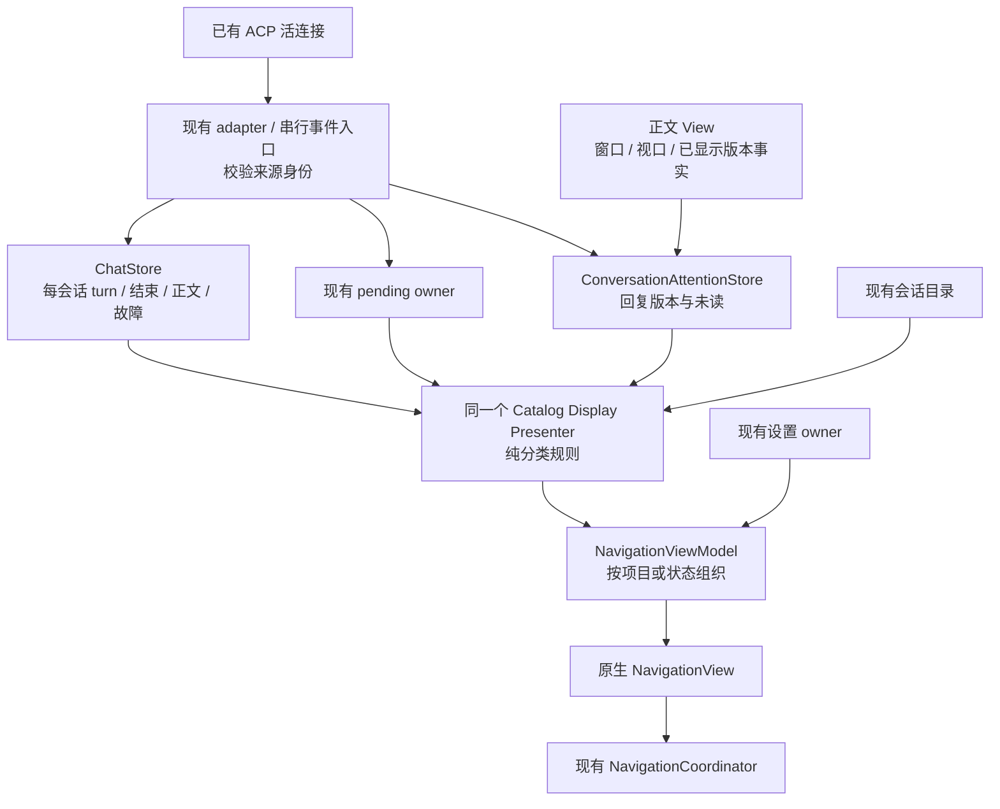

# 左侧导航栏按会话状态分组：开发计划

状态：计划已完成独立审查，现已进入实施与门禁验证。焦点留位契约已于 2026-09-12 获用户确认；Skia 实测已验证焦点留位与释放归组，原生祖先指示问题仍是交付阻塞。本文本地保存，不提交或推送；各平台最终验收以本次产物的真实门禁结果为准。

需求基线：[PRD-SESSION-STATUS-NAVIGATION.md](PRD-SESSION-STATUS-NAVIGATION.md)。固定三个分组：待处理 → 进行中 → 其他会话；已结束且未读的回复归待处理，已读且没有其他待办则归其他；原因只用图标表达，保留悬停与读屏说明。

## 开发方向

采用现有 **MVUX 状态 + MVVM 展示**：`ChatStore` 维护会话事实，既有交互请求与未读 owner 各守自己的职责，导航只做只读投影。继续使用 WinUI / Uno `NavigationView`、CommunityToolkit.Mvvm 和 Uno.Extensions.Reactive，首版不新增包、不升级 UI 框架。

设置优先即时生效，只改变导航投影；不重启 Agent、不重载整个程序。两个必须先用真实控件验证的点是：跨组移动时的原生选择/焦点，以及最新正文版本的可见确认。原生能力不能满足时先调整计划，不能用控件状态补丁或固定延时绕过。

实施顺序为 **M0 原生验证 → M1 会话工作状态 → M2 后台连接接线 → M3 已读回执 → M4 分组投影与设置 → M5 UI 与跨端验收**。M1/M2/M3 是本需求的必要基础，不借机重写整个 ChatViewModel、替换已有导航框架或新增任务调度系统。

## 官方依据

核对日期：2026-09-11。以下明确区分官方契约、本仓既有实现和本功能的应用设计。API 已实现不等于跨端视觉与输入行为已经验证；本文不声称完成构建或 GUI smoke。

### 技术基线

当前 `global.json` 声明 Uno.Sdk **6.7.22**、.NET SDK **10.0.302**；已安装的该版本 SDK 包 `Sdk.props` 锁定 Uno.WinUI **6.7.103**，其 NuGet 元数据关联官方源码提交 `cd452e3ee242c9a2a8dee5e65ad8088b6f5dbf83`。本轮没有 restore，因此它是 SDK 包声明的依赖基线，不是本次构建的资产证明。

`SalmonEgg/Directory.Packages.props` 已有 CommunityToolkit.Mvvm **8.4.2**、Uno.Extensions.Reactive **7.2.3**、Uno.WinUI.Lottie **6.7.103**、Uno.Fonts.Fluent **2.8.1**；Windows App SDK 固定在 **1.8** 线。`MainPage.xaml` 已使用 `NavigationView`、层级 `MenuItemsSource`、不可选项目分组、原生图标、`ProgressRing` 和 `x:Bind`。

本功能沿用这套依赖。Windows 使用 WinUI 3；其他目标使用 Uno 官方控件及其平台实现。本仓 Desktop/WASM 使用 SkiaRenderer，不能把这一点表述为每个平台的导航栏都是 GTK/AppKit 系统控件。

### 来源与落地约束

| 编号 | 一手来源与短引文 | 对本功能的结论 |
| --- | --- | --- |
| O1 | [Microsoft：NavigationView](https://learn.microsoft.com/en-us/windows/apps/develop/ui/controls/navigationview)。层级建议：“two levels is ideal for usability and comprehension”；选择契约：“no more than one selection indicator”。 | 原生两层“状态分组 → 会话”符合推荐。组使用 `NavigationViewItem`、`MenuItemsSource` 和 `SelectsOnInvoked=False`。折叠祖先原生承接已选子项的 indicator，展开后回到子项，无需强制展开或自绘选中条。该文也说明程序更新选中项可触发 `SelectionChanged`，而不会触发 `ItemInvoked`，不能把投影更新当第二条业务激活入口。 |
| O2 | [Uno：NavigationViewItem 支持表](https://platform.uno/docs/articles/implemented/microsoft-ui-xaml-controls-navigationviewitem.html)：“Implemented for: WASM, Skia, Mobile”。 | 本次所需的 `MenuItemsSource`、`SelectsOnInvoked`、`IsExpanded`、`Icon`、`InfoBadge` 已列为这些目标支持。表内独立 `MacOS` 列不等于本仓的 Skia macOS；仍须按实际 renderer 验证。 |
| O3 | [Uno 6.7.103 对应的 ItemsRepeater 源码](https://github.com/unoplatform/uno/blob/cd452e3ee242c9a2a8dee5e65ad8088b6f5dbf83/src/Uno.UI/UI/Xaml/Controls/Repeater/ItemsRepeater.cs#L928)：“internal structure does not support the Move action”。 | 当前实际依赖仍把 `Move` 拆成 Remove/Add；`ObservableCollection.Move` 不是保持容器状态的跨端保证。复用并扩展已有导航顺序稳定策略，真实控件树必须验证跨组迁移、快速点击、折叠与选中唯一性。不能用测试集合事件形状代替这些验证。 |
| O4 | [Microsoft：InfoBadge](https://learn.microsoft.com/en-us/windows/apps/develop/ui/controls/info-badge)：“a number, icon, or a simple dot”；同时不建议将其用作普通永久图标。 | 原生 dot badge 用于未读提示；三组的常驻总数用普通 `TextBlock`，避免把“其他会话数量”呈现成待办警报。不要再手画一个 `Ellipse` 未读点；不要在行右侧和左侧各放一个未读标记。 |
| O5 | [Microsoft：Icons](https://learn.microsoft.com/en-us/windows/apps/develop/ui/controls/icons)：“SymbolThemeFontFamily”；“IconElement ... can't ... be ... reused as a shared resource”。 | 普通状态用 `SymbolIcon` 或绑定系统字体资源的 `FontIcon`；每个模板实例有自己的图标控件。需要共享时共享字形数据或 `IconSource`，不共享已挂到视觉树上的控件。字形选择须核对现有 Fluent 字体资产，禁止新加 emoji/位图体系。 |
| O6 | [Uno：ProgressRing](https://platform.uno/docs/articles/features/progressring.html)：“add a reference [to] the Lottie package ... or the ring will not be displayed”。 | 当前 WinUI `ProgressRing` 已有所需 Uno.WinUI.Lottie，复用官方动画，不自绘旋转器或加入逐行 Timer。文档分列 WinUI 与旧 UWP 控件，不能把旧 UWP 的 native styling 说明套到当前 MUX 控件。 |
| O7 | [Microsoft：Data binding in depth](https://learn.microsoft.com/en-us/windows/apps/develop/data-binding/data-binding-in-depth)：“{x:Bind} default of one-time”；可变集合建议 `ObservableCollection<T>`。 | 模板声明 `x:DataType`；状态、图标、数量及文案显式 `Mode=OneWay`，设置选择用 `TwoWay`。原生 `IsExpanded` 变化可双向投影，但不能直接当用户偏好保存；见折叠规则。保留有身份的行 VM 和增量集合，不能每次流式片段重建整树。 |
| O8 | [Microsoft：DispatcherQueue](https://learn.microsoft.com/en-us/windows/apps/develop/dispatcherqueue)：“background threads to run code on ... the UI thread”。 | 复用现有 `IUiDispatcher` / `WinUiDispatcher`。状态事实可在无 UI 依赖层归并，绑定属性与集合通知必须在 UI 线程发布，并在应用投影时复核身份/最新意图；不创建新的 DispatcherQueue 或线程。 |
| O9 | [Microsoft：MVVM Toolkit](https://learn.microsoft.com/en-us/dotnet/communitytoolkit/mvvm/)：“Platform and Runtime Independent”；“maintained and published by Microsoft”。 | 继续用已有 `ObservableObject`、生成属性和 `RelayCommand` / `AsyncRelayCommand`。它官方支持 Uno/WinUI、已被本仓采用且跨平台，足以支撑本功能，不另引导航/状态框架。 |
| O10 | [Uno：MVUX Overview](https://platform.uno/docs/articles/external/uno.extensions/doc/Overview/Mvux/Overview.html)：单向、不可变数据流。 | 单向数据流与单一事实源适用于本功能；采用现有 MVUX owner 时只派生投影，不能同时增加一份可写 MVVM 状态和一份可写 `IState`。本轮不因新增导航分组而迁移现有 MVVM 导航到 MVUX。 |
| O11 | [Microsoft：Basic accessibility information](https://learn.microsoft.com/en-us/windows/apps/design/accessibility/basic-accessibility-information)：“name, role, and value”。 | 行的 `AutomationProperties.Name` 包含标题、项目和状态含义；图标提示用原生 `ToolTipService.ToolTip`。原生容器继续提供角色、选择和展开语义，避免把装饰图标做成额外焦点站；不要以悬停代替触控可到达的实际问题/请求。 |
| O12 | [Uno 6.7.103 官方控件源码目录](https://github.com/unoplatform/uno/tree/cd452e3ee242c9a2a8dee5e65ad8088b6f5dbf83/src/Uno.UI/UI/Xaml)。已核对 `NavigationViewItem.Properties.cs`、`InfoBadge.cs`、`ProgressRing.cs`、`ToolTipService.Properties.cs`、`AutomationProperties.cs`。 | `NavigationViewItem.Icon` 是 `IconElement`；`ProgressRing` 是 `Control`，不能直接赋给 `.Icon`。Tooltip、Name/HelpText/AccessibilityView 的附加属性有真实实现；`ProgressRing.IsActive=False` 会调用动画播放器 Stop。源码确认的是 API/实现路径，实际读屏质量和不可见动画负载仍需目标平台验收。 |
| O13 | [Uno：IState](https://platform.uno/docs/articles/external/uno.extensions/doc/Reference/Reactive/state.html)、[IFeed](https://platform.uno/docs/articles/external/uno.extensions/doc/Reference/Reactive/feed.html)、[不可变 record](https://platform.uno/docs/articles/external/uno.extensions/doc/Learn/Mvux/WorkingWithRecords.html)。State 与 owner 同生命周期；`Select` 可派生数据；record 的内部对象也需保持不可变。 | 沿用已有 `State.Value`、`State.Update`、immutable record/collection 和可释放订阅。纯分类由函数/投影完成，不增加一个可写状态镜像；不为本功能封装 `State.Create`、自造 reactive runtime 或另一套消息总线。 |
| O14 | [Microsoft：RelayCommand generator](https://learn.microsoft.com/en-us/dotnet/communitytoolkit/mvvm/generators/relaycommand#handling-concurrent-executions)：`AllowConcurrentExecutions` 默认 false；带 cancellation token 的命令在再次执行时可能取消上一次调用。 | 发送多个会话不能只开并发开关。必须先让 operation/CTS 按会话归属；同会话门控仍由原子 admission 保证。`IsRunning` 不能当所有会话的业务状态，`CanExecute` 变化用 Toolkit 的 `NotifyCanExecuteChanged` 通知。 |
| O15 | [WinUI：EffectiveViewportChanged](https://learn.microsoft.com/en-us/windows/windows-app-sdk/api/winrt/microsoft.ui.xaml.frameworkelement.effectiveviewportchanged?view=windows-app-sdk-1.8)、[Uno：FrameworkElement 支持表](https://platform.uno/docs/articles/implemented/microsoft-ui-xaml-frameworkelement.html)、[Window.Activated](https://learn.microsoft.com/en-us/windows/windows-app-sdk/api/winrt/microsoft.ui.xaml.window.activated?view=windows-app-sdk-1.8)。有效视口通知在 arrange 后产生，但“在视口内”不保证没有遮挡。 | 可以采集原生视口事实，但要合并所属窗口、root、正文版本与 overlay。支持表不等于已经证明 Markdown 内容完成呈现；M0 必须验证真实文本宿主。 |
| O16 | [WinUI：LayoutUpdated](https://learn.microsoft.com/en-us/windows/windows-app-sdk/api/winrt/microsoft.ui.xaml.frameworkelement.layoutupdated?view=windows-app-sdk-1.8)、[CompositionTarget.Rendering](https://learn.microsoft.com/en-us/windows/windows-app-sdk/api/winrt/microsoft.ui.xaml.media.compositiontarget.rendering?view=windows-app-sdk-1.8)。前者是布局通知；后者的常驻处理会强迫逐帧运行并影响节能。 | 不用 `LayoutUpdated`、队列回调、固定 sleep 冒充某一版正文已经显示；不添加长驻逐帧已读轮询。渲染事实按事件采集、合并，订阅按 View 生命周期释放。 |

### 最小原生 UI 方案

1. **继续使用现有 `NavigationView`。** 新增状态组行模型和模板，复用会话行、稳定 semantic ID、导航协调器、菜单与分页模式。不换成裸 `ItemsRepeater`、自造 TreeView 或另一套选中模型。
2. **组标题保持原生可折叠容器。** 内容用系统布局放标题和普通计数，`IsExpanded` 由原生控件拥有，持久化只记录可确认的用户展开意图。Compact/flyout 自动收起不覆盖偏好。空组保留标题与零计数，不伪造 `HasUnrealizedChildren` 来强画箭头。状态变化不触发自动展开；目标组已折叠时使用 O1 的原生祖先选择指示。
3. **会话状态放在一个左侧槽位。** 由于 O12 的类型约束，在会话 `Content` 的原生 `Grid` 左栏组合 `SymbolIcon`/`FontIcon`/`ProgressRing`；未读时在该槽位组合一个原生 dot `InfoBadge`，行的 `.Icon` 不再重复声明固定 Comment。其余栏是标题、项目与时间。使用已有布局/字体资源，不修改 `NavigationViewItem` 控件模板，不引入“任何 UIElement 都能充当 IconElement”的包装控件。首个 UI 验证必须覆盖 Auto 模式下 Left、LeftCompact 子项 flyout 与窄屏，确保内容槽位实际可见且布局自然；若不通过，应调整原生内容布局并审阅，不以像素补偿绕过。
4. **表现数据只有一个入口。** Core 输出语义状态，UI 映射到现有字体字形/原生控件；分类规则不写在 converter、XAML、多套触发器或 code-behind。悬停与 AutomationName 复用同一状态文案投影，行内没有“新回复/等待批准”等常驻文字。
5. **维护原生视觉和交互。** 选择、焦点、hover、pressed、展开箭头、辅助功能角色与主题由控件拥有。继续从 `ItemInvoked` 表达业务意图；`SelectedItem` 只接受已有导航 owner 的投影。跨组迁移不能依靠手动改每个容器的 `IsSelected`、吞指针事件或延时选回补偿。
6. **动画与订阅有生命周期。** `IsActive` 只为实际需要显示的运行状态开启；须确认折叠、退出视口、回收复用和页面卸载后无持续不必要动画。先验证框架行为，有缺口才通过现有 View 适配边界采集可见事实，不能另立运行状态 owner 或每行定时轮询。后台会话状态继续来自业务事件，不因 UI 停止动画而停止接收。

以上为开发选择，并非官方对 SalmonEgg 产品分组的规定。原生框架不定义“回复已读”“待处理优先级”或“何时可以跨组搬行”；这些应用语义必须在现有会话/导航链路中保持 SSOT，并用行为测试及真实 GUI 证据验证。

## 当前源码与必要改动

源码基线：`cab0a410`。以下是静态阅读所得，不是已运行的缺陷复现报告；实现开始前应确认 HEAD 与这些入口仍一致。

| 位置 | 当前事实 | 对实施范围的影响 |
| --- | --- | --- |
| `Mvux/Chat/ChatState.cs:12`、`ChatReducer.cs:54,430` | 只有一个 `ActiveTurn`，切换会话会丢弃其他会话的 turn | 工作状态必须按会话保存；当前会话状态改为同一数据的投影 |
| `ViewModels/Chat/ChatViewModel.CommandWorkflow.cs:108,350,417` | 发送命令默认禁止并发；CTS 全局一份；失败可能回填当前输入 | 隔离每次发送身份与 CTS，同会话防重复；后台失败不能改前台草稿 |
| `ChatViewModel.RemoteConversationLifecycle.cs:1050`、`ChatViewModel.cs:3382` | 更换前台 service 会退订旧 service，即使旧连接仍在池内 | 订阅应跟随真实连接存续，切换前台只改变投影 |
| `Services/Chat/AuthoritativeRemoteSessionRouter.cs:36` | 现有路由按 remote session ID 查找 | 加入 profile、连接实例与 service 归属，覆盖不同 Agent 复用相同 ID |
| `ChatViewModel.AcpSessionLifecycle.cs:577`、`src/SalmonEgg.Acp/Protocol/SessionPromptTypes.cs:62` | UI 合并正常结束和达到限制；SDK 已保留 `StopReason` 及 `HasStopReason` | 复用现有 wire 信息，保存真实结束原因，不能把默认值误认为正常结束 |
| `ViewModels/Chat/Panels/ChatConversationPanelStateCoordinator.cs:15` | 已按会话持有 permission、ask-user、elicitation | 扩展只读摘要和变更通知，不再复制一份 pending 字典 |
| `ChatViewModel.SessionPresentation.cs:860` | 操作错误只有一份 `_failure` | 将会话操作错误纳入现有 ChatStore；删除原单条 owner，保留原错误展示入口 |
| `ChatViewModel.AcpSessionLifecycle.cs:101,750`、`RemoteConversationLifecycle.cs:160` | 只给后台消息记未读，激活/恢复会直接清读 | 前台脱底也要记录新内容；改为匹配实际可见版本的回执 |
| `Mvux/Chat/ConversationAttentionState.cs:14`、`ConversationAttentionReducer.cs:30` | 已有 `UnreadVersion`，清读没有版本条件 | 复用版本与串行入口，增加 compare-and-clear，不另建阅读状态库 |
| `Services/Chat/ConversationCatalogDisplayPresenter.cs:114` | 当前只合并目录与未读 | 扩展同一个 presenter 合并工作、交互和错误的只读投影 |
| `ViewModels/Navigation/MainNavigationViewModel.cs:977,1133,1360` | 按项目同步行，最多先展示 20 条，分页外激活仍依赖项目索引 | 状态分组、跨组搬行、更多入口和搜索命中需一起适配 |
| `Services/Chat/AcpConnectionDependencySnapshotProvider.cs`、`AcpConnectionPoolManager.cs:168` | hard-pin 只保护前台 profile | 从在途工作与有效 pending 派生后台保护，结束释放，不另加连接保活器 |
| `Services/Chat/AcpChatCoordinator.cs:813,841` | resync callback 绑定原前台 apply token 和 sink；pool-only 没有 callback | 后台订阅之外还需按来源连接恢复缓冲溢出，不能让 A 切后台后永久 suppress |
| `Services/Chat/AcpConnectionSessionCleaner.cs:106` | hard-pinned 连接不参加 warm/soft-pinned 数量淘汰 | 当前不是全体活连接的总量上限；保护忙连接时不能声称复用了不存在的总量准入 |
| `Services/ApplicationShutdownWorkflow.cs:115` | 退出不整体 Dispose DI 容器 | handler、队列和 operation 必须接入实际 drain/关闭流程，不能只依赖 VM.Dispose |

表中未展开前缀的源码路径相对 `src/SalmonEgg.Presentation.Core/`。

## 状态所有权与数据流

SSOT 是“每项事实只有一个写入者”，不要求把所有对象塞进一个大 Store。保留现有职责划分：

| 事实 | 唯一 owner | 下游使用方式 |
| --- | --- | --- |
| 已存在连接、profile、connection instance | `AcpConnectionSessionRegistry` / 现有 connection store | 订阅持有来源快照；连接移除即使快照失效 |
| 会话 binding、正文、hydration、每会话 turn/结束原因/操作故障 | `ChatStore` + `ChatReducer` | 不可变快照；`ActiveTurn`、当前错误面为只读投影 |
| 发送任务与 CTS | 现有发送 workflow 的 operation 句柄 | 仅持有可取消资源，不存另一份 Phase、Group 或 IsRunning |
| 请求是否仍有效、响应是否成功 | ACP SDK 请求对象及已有响应流程 | UI 不能以按钮点击或表单隐藏代替协议结果 |
| 客户端当前待交互对象 | `ChatConversationPanelStateCoordinator` | 原对象只读摘要；变更时重新投影，不复制请求 |
| live 回复版本、未读与已读确认 | `ConversationAttentionStore` | 正文携带该 owner 发出的版本标识；View 只报告所见版本 |
| 会话分组、原因图标语义、组计数 | `ConversationCatalogDisplayPresenter` + 单个纯分类 policy | 派生值，不持久化、不手动改状态 |
| 语义选择与会话激活 | `INavigationCoordinator → IConversationSessionSwitcher` | `SelectedItem` 单向投影；分组更新不调用激活 |
| 原生选择、焦点、展开、滚动 | WinUI / Uno 控件；现有 viewport controller 管应用滚动意图 | View 采集原生事实，只有官方配置与已有导航意图可影响控件 |
| 分组模式、折叠偏好 | `AppPreferencesViewModel → IAppSettingsService` | 唯一设置写链路，复用 YAML 与 canonical 值目录 |

### 工作状态与后台接线

- 在现有 `ChatState` 中增加每会话 turn 集合，复用 `ActiveTurnState` 和 `ChatTurnPhase`。原 `ActiveTurn` 改为当前有效会话的只读解析；后台全部显式使用 `ResolveTurn(conversationId)`。不得保留可独立写入的两份 turn。
- turn 保留 operation 使用的 conversation、turn、profile、remote session、connection instance 身份与原始结束原因。Begin/Advance/End/Fail/Cancel 只处理匹配的当前轮次；旧轮次或旧连接不能结束新工作。
- `PromptSendContext` 在命令接受时捕获目标与草稿版本；复用 `AcpSessionCommandOrchestrator`，把请求、认证、恢复、重试和 dispatch 通知的前台隐式读取改为本次 operation 上下文。重连后取得的新连接身份也要显式更新该 operation 的绑定。
- 使用已有 Toolkit `AsyncRelayCommand` 支持跨会话执行，operation 持有自己的 CTS。保留方法内部的原子同会话 admission，覆盖鼠标/快捷键/多窗口同时触发。禁止只依赖按钮 disabled、全局 `IsRunning` 或开并发开关。`finally` 只释放自身句柄；取消只命中所选会话。
- 草稿继续沿用现有 `DraftText/DraftRevision`：只有目标仍为当前会话、草稿版本仍匹配且用户未输入新内容时，失败才允许回填。后台原 prompt 保留在对应 turn/用户消息中用于现有重试入口，不借本功能新建每会话草稿系统。
- 会话操作故障合并进入 ChatStore，原 `_failure` owner 删除。prompt failure 来自 turn；请求发送失败来自原 pending 对象；连接 fault 来自原连接/会话事实。分类不再复制第三份错误，读过不会默认解除可操作故障。
- 订阅随 registry 活连接实例注册、复用、替换和移除，对账只存 handler 句柄。源事件、完成回调入队时捕获 service/profile/connection identity，应用时再复核；不信装饰器透传的 sender，也不再从“当前 profile”猜归属。
- 所有 update、权限、结构化输入、terminal 和 fault 共用扩展后的现有权威路由。`PoolOnly` 不退订仍有效连接；前台切换不清全体 pending。SDK 请求失效、发送成功、取消与失败重试仍由原请求实例负责。
- 复用 `SerialAsyncWorkQueue` 和每个 service 各自的现有 adapter。入队只处理短状态归并，不把长 prompt/网络等待或等待用户输入放在全局串行队列中阻塞其他会话。VM 共享的 update/transcript observation 字典与 hydration 追踪键也加入实际来源身份；不能只改消息 router，而继续按 remoteSessionId 混合不同连接的恢复计数。
- 调整现有 `WrapChatService → HandleResyncRequiredAsync`：前台与 pool-only 连接都拥有跟随连接生命周期的恢复 callback，按来源会话与连接调用既有 recovery owner，不能依赖原前台 apply token、`sink.CurrentChatService` 或当前绑定。缓冲溢出仍保留原限流与 suppress/resync 机制；恢复不能抢前台选择。对端不支持所需恢复或恢复失败时，相关工作进入可解释的故障/未知状态并允许现有操作恢复，不能永远 suppress 仍显示运行。
- 连接替换、移除与 drain 必须有一次显式 retirement 归并：用被移除的旧连接快照和原因，先使旧 ingress 不再接受更新，再在同一控制链收敛它的在途 turn、pending、operation/CTS 与回调，随后释放资源。该控制事件不受“registry 已删除所以丢弃”的入站门控过滤。意外断线标记受影响的工作为需恢复；主动断开/退出按取消处理，完成历史不批量变红；新连接上同名会话不受影响。不能指望已经被门控拒绝的旧 prompt finally/错误回调完成收尾。
- 连接池保护名单从当前 turn/pending 派生，只保护用户已启动工作的既有连接。已有 warm/soft-pinned 阈值只管理可回收缓存，hard-pinned 并不受其总量限制；全部候选都忙时延后自动淘汰，工作结束后立即重新进入现有 cleaner 规则。该功能不自动启动更多 Agent，不新增总任务调度器，也不声称设置了并不存在的活连接资源硬上限。主动断开与 shutdown 仍可终止受保护连接。初始化幂等，实际 drain 撤销订阅并观察任务，不另加保活 Timer。
- 工作、结果及阅读投影是运行期事实，不进入 workspace 的远程正文持久化真源。需检查 `ChatStore.Generation → WorkspaceWriter` 路径，状态图标变化不能产生不必要的磁盘写入；沿用既有持久化边界及选择性投影。

### 已读回执

1. 接受新的 **live 回复内容** 时，不再按前台/后台决定是否登记。由现有 attention owner 分配单调版本；未读高水位属于稳定的逻辑会话（conversation + profile + remote session binding），不永久绑定某个连接或本地消息 key。正文携带该版本及当前连接/内容锚点，供本次显示回执核验。复用 `UnreadVersion`，不在 View 或第二个 Store 再发一套版本。
2. 同一个 MessageId 的流式追加也会产生新内容版本；仅有稳定消息 ID、`CollectionChanged`、`SizeChanged` 或最新全局版本都不能证明 View 显示的是这一版。View 只能回传已绑定正文携带的版本。
3. `ConversationAttentionStore` 在现有串行入口内做版本和身份比较；旧回执不得清掉较新内容。未读版本、最后已读版本只有该 owner 可写；需要同一批更新的 token 分配与内容发布在 ingress 内按固定顺序完成，不能跨两个 Store 任意 fire-and-forget。
4. 复用 `ListViewTranscriptViewportHost` 和 `TranscriptViewportController` 观测指定内容末端，不创建新的 scroll/follow controller。结合原生 effective viewport、当前已绑定正文和真实内容宿主的呈现进度；长消息只露旧上半段不算读到新内容，原生容器 realized 或 scroll offset 到底不是充分条件。
5. Main/Mini 分别采集窗口/root，复用 `AppActivationSignalSource` 和 `ApplicationWindowActivityTracker`，在同一 owner 补充 deactivation/close 通知。已读要求对应窗口有效且激活、View loaded、属于当前 root 和会话、authoritative 内容已显示、应用 overlay 没有遮挡。WASM 隐藏标签页的事实由现有平台层补齐，不能只凭 app-wide IsActive。
6. 回调执行前再检查上述事实。复用原 viewport activation generation，但它不会在每次 unload/overlay 都变化，因此还要校验 host 实例与当前 attach/root/overlay 状态；不新增焦点 generation。
7. 移除所有“激活成功/恢复结束/热切回就 ClearUnread”的旧写入点，统一进入回执。live/replay 来源在现有 per-session hydration attempt 入口保留；若协议对恢复期间某段内容的来源没有足够依据，保留不确定性，不猜成新未读或已读。历史重放本身不制造新 live 通知，也不清除尚未显示的结果。
8. 同一进程内连接被回收后冷恢复，开始恢复时快照该逻辑会话未读高水位 V。仅当本次权威完整 replay 已覆盖原回复、协议恢复完成且对应入站队列已经应用，才把 V 重锚到新正文的可读末端；重锚本身不清读，仍要新窗口/连接/root 的有效可见回执。恢复中及之后新 live 的 V+1 等版本不被 V 回执清除。v1 可缺省 messageId，不能靠新旧本地 key 相等判断覆盖；仅 resume 而没有 replay/权威内容也不构成屏障。无法证明覆盖关系时不得自动重锚，属于 M3 必须解决的交付阻塞点，不能以无限保留未读代替完成；需要显式“标为已读”等新交互时另行提出产品变更。
9. 事件触发观测，按现有 UI 队列合并；不常驻帧事件、轮询或逐行 Timer。内容版本变更也触发有界复核，以覆盖大小未变的文本追加。框架没有可验证的呈现事实时先不清读；必须在 M0/M3 补齐再次观测与最终收敛证据，不能让未读永久滞留。
10. 首版沿用当前内存阅读状态，不新建跨进程消息缓存或阅读数据库。重启后没有可靠新事实的会话归其他；设置与折叠偏好仍持久化。如果之后要求跨设备未读同步，另立需求。
11. 终态与已读的发布必须收敛到同一次既有 UI 摘要投影：若最后版本已在当前窗口实际呈现，但对应回执尚在队列，先完成该版本的可见确认，再发布结束后的分组；不短暂闪入待处理。没有可见事实的后台会话应立即进入待处理。入口按现有串行/投影调度建立顺序屏障，不设置固定防抖、不等待不存在的用户回执；较新尚未呈现的版本仍保持未读。M3 必须断言整个观察序列，而不只验证最终组别。

### 唯一分类规则

纯 policy 的输入是以上 owner 的只读快照，输出只包含组别与表现语义。不得根据可见文本、文件名、时间接近或计划进度猜状态。

| 优先级 | 当前有效事实 | 分组 / 主图标 |
| --- | --- | --- |
| 1 | 需要用户介入的操作/连接故障 | 待处理 / 警告 |
| 2 | 仍有效的权限请求 | 待处理 / 盾牌 |
| 3 | 仍有效的结构化输入请求 | 待处理 / 问号气泡 |
| 4 | 本会话本轮未结束 | 进行中 / 原生进度指示 |
| 5 | 本轮已结束且有未读回复 | 待处理 / 带未读点的会话图标 |
| 6 | 其余或缺乏可信工作事实 | 其他会话 / 普通会话图标 |

该表把 PRD 留待调研的多原因优先级具体化：首先提示阻止处理的故障，其次权限、回答；一次只呈现一个主图标，悬停/读屏可说明其他仍有效事项。阅读只改变第 5 项。

结束处理：`end_turn` 且确实有内容时按阅读情况归组；`max_tokens/max_turn_requests` 与阻止继续的失败进入原有可操作问题流程；`refusal` 以实际回复/失败事实呈现，不冒充成功；主动取消无其他事项时归其他，有尚未读的实际回复则保留待处理。未知结束原因也必须终结本次运行记录，保留原始原因；缺失 v1 必填结束原因不得因 DTO 默认值判正常，进入现有协议诊断/错误流程。判定要测试真实 wire 的 `HasStopReason`，并核对手工构造 DTO/现有 mock 的 presence 语义，不能只补 UI 守卫导致合规测试夹具全部被当成对端违规。具体错误操作复用现有重试、取消、关闭提示入口，不新增导航专用错误操作。

### 导航、设置与稳定性

- 扩展 `ConversationCatalogDisplayPresenter` 输出上述语义，保留独立 readonly runtime 和 catalog 来源。导航只订阅轻量摘要的变化：若仅正文 chunk 更新而组别、图标、标题等未变，不重建整棵树。
- `MainNavigationViewModel` 增加模式投影与三个固定状态组，单个全局会话行索引以 `ConversationId` 保持实例。跨组先建立完整目标索引，再修改可见集合，最后由原 selection projector 投影；不能因从旧组移除就 Dispose 仍在新组使用的行。
- 会话的 `ProjectId` 继续来自原 project affinity resolver，状态组 ID 是展示身份，不伪装成项目。`CanMaterializeSelectedSession`、搜索/通知/更多入口均按完整目录确认会话，然后按当前模式确保可见，不能继续只查 `_projectIndex`。
- 设置在 `AppSettings → AppSettingsYamlV1 → AppSettingsService → AppPreferencesViewModel` 现有链路增加规范化值 `Project/Status`，默认 Project。`AppSettingValueCatalog` 作为值域唯一来源，GUI、CLI、缺省/未知值读回与 reset/save/clone 路径同步更新；旧配置不需要破坏性迁移。
- 折叠偏好只保存三个稳定组键的明确用户展开选择，不保存会话状态。原生 `IsExpanded` 的运行期投影与用户持久偏好语义分开：前者由控件拥有，后者仅由已确认的用户展开/折叠意图更新，不能在每次 TwoWay setter 自动保存。[锁定 Uno 源码](https://github.com/unoplatform/uno/blob/cd452e3ee242c9a2a8dee5e65ad8088b6f5dbf83/src/Uno.UI/UI/Xaml/Controls/NavigationView/NavigationViewItem.cs#L939) 的 `ForceCollapse` / `OnFlyoutClosing` 也会写 `IsExpanded=false`，Compact 切换与子项 flyout 关闭不算用户修改默认偏好。M0 核定 pointer、keyboard、UIA 的显式展开事实来源；无法可靠区分时必须修订方案，不能猜测或默默取消偏好持久化。初始化只按偏好配置原生控件，此后不回写争抢其状态；设置 owner 独占保存。
- 模式切换优先只重投影导航，不调用 `ReloadShell`、session/load 或连接重建。正文/草稿/在途 operation 均不受影响；若 M0 证明本依赖无法安全动态切换，计划应明确改为“下次启动生效”，不得自行增加强制重启。
- 状态模式沿用每组先展示 20 条的有界策略，始终额外保留当前/在途激活会话。更多行复用原 `MoreSessionsNavItemViewModel` 的命令入口，在当前组继续揭示下一批 20 条；不把状态 key 传给 project-only 方法。原项目视图保留原更多入口，避免为了状态模式扩写旧对话框的 code-behind 过滤逻辑。数量来自完整已收录目录，而不是可见行数。
- `NavigationSessionOrderPolicy` 目前只稳定单个组内顺序，并会移除离开 desired set 的行，**不能原样当跨组冻结规则**。扩展同一个导航投影策略，在 catalog loading、已有激活在途或原生导航交互未收敛时，暂缓既有行的组迁移/重排，仅更新行图标等表现。安全后应用最新目标，并由原生 selection projector 恢复同一语义选择；禁止保留过期目标队列逐个播放。
- 原生 pointer/keyboard/focus 事件只能只读通知现有 UI adapter，不能设 handled、强改 IsSelected/Focus 或新建视觉状态机。按住期间由现有输入事实暂缓搬行；松开后仍有原生焦点的会话暂留原组并更新状态图标，源组保持已显示行顺序、追加新行、删除真正退休项，其他会话正常归组。`GotFocus` 只报告当前焦点的 conversation ID，焦点离开时由同一导航投影应用最新目录，不保留旧目标队列，不增加 focus generation 或固定延时。该焦点留位契约已由用户于 2026-09-12 确认。
- 原生已选子项在目标折叠组内时，显示父组选择指示；不强制展开。已有行与组的 count/列表成员要使用同一次展示投影，不能计数先移走、行还在旧组造成临时自相矛盾；稳定后与真实分类一致。
- 按状态的活动排序只在真实轮次开始、结束、新请求、故障等边界推进，流式片段不更新排序时钟；其余复用 catalog 时间。安全排序可容忍短暂延后，不能改变业务状态。
- 新字符串走现有 `CoreStrings*.resx` 和 `Strings/{en,en-US,zh-Hans}/Resources.resw` 各自资源职责；共享文本复用同一个键。保持 PRI 生成链路，验证实际 MSIX 资源，不能把属性名错误或漏语言留到运行期。

## 分阶段开发清单

每阶段都要求对应验证通过再进入依赖阶段。代码改动阶段提交采用英文 Conventional Commits；此处描述未来实施，本轮不执行提交。

| 阶段 | 工作与主要文件 | 完成条件 |
| --- | --- | --- |
| M0 原生能力验证 | 在既有导航/正文 GUI 夹具内验证真实 NavigationView 跨父组移动、折叠祖先选择、焦点、Content 内状态槽；核验实际文本/Markdown 的版本可见回执 | Windows WinUI 3 与 Skia Desktop 同路径通过，WASM 验证对应行为；危险假设有正反证据。不能满足时先修订这份计划，不能带着假设进入 UI 实现 |
| M1 会话隔离 | `Mvux/Chat/{ChatState,ActiveTurnState,ChatAction,ChatReducer}.cs`、`ChatViewModel.CommandWorkflow.cs`、`AcpSessionCommandOrchestrator.cs`、错误投影 | A/B 工作与取消隔离，旧结果不改新 turn、不改其他草稿；所有结束原因有终态，原按项目路径回归通过 |
| M2 后台与交互 | 现有 registry/events、`AcpEventAdapter`、remote router、resync callback、VM subscription、panel coordinator、dependency snapshot、startup/shutdown | A→B 后 A 更新/请求/结束仍归 A；同名 remote ID 不串线；后台溢出恢复不夺前台；retirement 显式收尾且拒绝晚到更新；真实退出释放本次任务与进程 |
| M3 已读回执 | `ConversationAttention*`、正文 snapshot/投影携带版本、`ChatView`/`MiniChatView`、现有 viewport host 与 activation source | 前台脱底/最小化不误清，旧内容回执不清新版本；连接回收后 cold replay 可重锚且阅读后收敛；有/无 messageId 均验证；移除旧无条件清读，正反 GUI 证据通过 |
| M4 设置与投影 | AppSettings/YAML/value catalog/preferences、CatalogDisplayPresenter、纯分类 policy、Navigation VM/组 VM/更多入口 | 三组与优先级穷尽；每会话只出现一次；即时切换不重连；设置、折叠保存与旧配置兼容；分页外激活仍正确 |
| M5 原生 UI 与完整回归 | `MainPage.xaml`、既有模板选择器/adapter、Appearance XAML、资源、现有 GUI gates | 仅图标表达原因，正常布局与无障碍正确；跨组、折叠、快速点击、窄屏与动画卸载通过；当前提交全部相关 CI 全绿 |

实现只新增有明确职责的最小类型，例如一个纯分类 policy 和一个状态组 VM；其余优先扩展上述既有 owner。M0 诊断代码只留可复用的门禁，临时探索脚本不进入正式产品。

M0/M3 的三个硬出口如下，不能用“待后续观察”视为通过：

- **迁移**：鼠标按住一行时发生完成/清读、键盘在会话间移动、目标组折叠、快速往返切换；必须证明不误触、不重复激活、selection 最多一个。key-up 后焦点仍在 A 时，A 完成只更新图标并暂留原组，下一次 Enter 仍作用于 A；用户把焦点移到另一会话、组标题或正文后，A 立即按最新状态归组。验证其他会话仍更新、源组无重排、计数与当前展示成员一致、焦点释放后不饿死；临时撤掉焦点保护必须重现旧入口的焦点丢失。已有真实失败说明仅在 key-up 解除所有保护不足以保持原生输入语义，不能用强设焦点或选中补偿。
- **偏好**：鼠标、键盘、UIA 明确展开/折叠都能保存；Left→LeftCompact→Left、子项 flyout 打开/关闭不覆盖用户偏好；空组和首次恢复不凭自动事件写坏配置。
- **阅读**：真实纯文本、Markdown、长消息、同尺寸追加、图片/复合内容完成呈现都有可断言的正文版本事实；记录具体原生 signal 与实际内容宿主，不能只记录 offset/layout。最终 chunk 到达后，即使没有新输入、滚动或尺寸变化，也要在真实呈现后自动收敛；还须覆盖“已呈现、回执未应用、end_turn 先到”时不闪入待处理。C1 回收→C2 权威重放（包含 v1 无 messageId）、旧 root 回执、恢复失败与恢复中新增内容均不会误清或永久滞留。缺少原生/现有宿主可用事实时明确阻塞对应里程碑，修订最小方案，禁止遍历第三方 Markdown 内部树或加常驻逐帧轮询。

## 验证与交付门禁

### 行为测试

复用仓库已有 xUnit/Moq/FsCheck 与现成测试缝隙，不增测试框架：

1. **状态表**：已结束未读/已读、正在流式、权限/提问覆盖运行、工具 pending、不阻塞的工具失败、取消/拒绝/超限/未知终态、无状态历史；多原因主图标优先级。
2. **跨会话与身份**：两个会话真实命令入口并行，重复提交同会话，取消其中一个，后台失败不覆盖前台草稿，profile 同名 remote ID、旧连接重连、旧 turn 完成、新请求复用 ID。
3. **接收与释放**：foreground/pool-only/reuse 三条注册路径；后台 buffer overflow 恢复不依赖旧 foreground token，同名 remote ID 的恢复计数隔离；重复初始化、shell reload、Mini 打开不叠加订阅；移除/drain 显式收尾 turn/pending 后无 handler 和未观察任务；TTL 不逐出忙连接，全部忙时延后自动回收，结束后恢复原预算规则。
4. **已读**：live/replay、旧回执与新内容反序、同一消息原位增长、最后内容尚未投影、隐藏/最小化/overlay/旧 root、主窗和 Mini 切换；连接回收后无 messageId 的冷重放、覆盖关系缺失、恢复中新增水位；读取不解除 pending/fault。
5. **导航与设置**：默认值/未知值、load/save/reset/CLI round-trip、空组计数、三组唯一归属、冻结与恢复不饿死、当前会话超过 20 条限制、更多显示、归档/搜索/通知激活、模式切换不调用 session/load。
6. **原有契约**：warm reuse、冷激活正文边界、latest intent、权限应答/elicitation delivery、输入与退出；不能因为新视图而放宽这些门禁。

优先扩展 `ChatReducerTests`、`ChatViewModelTests`、`ConversationAttentionReducerTests`、`ConversationCatalogDisplayPresenterTests`、`MainNavigationViewModelSelectionTests`、`NavigationSessionOrderPolicyTests`、`Panels`、settings 与现有 pool/shutdown 测试。断言用户行为与 transport 是否实际发送；不以字符串扫描或 mock 调用次数冒充显示正确。

### 构建与真实 UI

- Core/Domain/Application/Infrastructure/Presentation.Core 的受影响测试与 Release 构建；如果改了 SDK wire 代码，还要跑 ACP SDK 包消费门禁。不要为了本功能直接启用 draft runtime。
- Desktop 与 BrowserWasm 分别 restore/build，使用应用自有 `SalmonEggTargetFrameworks`/`SalmonEggAllTargetFrameworks` 收敛目标，restore 与 build 属性一致。不要把平台 `TargetFramework(s)` 当全局 restore 属性污染引用项目。构建和同项目测试串行，给命令外层 timeout。
- Microsoft.Testing.Platform 使用 `dotnet test --project ... --timeout ...` / `--filter-class`。先相关测试，最后受影响程序集全套；不得声称未运行的总测试数量。
- **Windows**：本次 `build.bat msix` 或 `.tools/run-winui3-msix.ps1 -SkipInstall` 的真实包，检查 PRI、安装启动并用现有 FlaUI 门禁验证鼠标/键盘/读屏语义；仅 cross-build 不算 WinUI 验证。
- **Skia Desktop**：扩展 `run-skia-nav-mask-probe.sh` 与既有 GUI smoke。独立 DEBUG 诊断驱动施加负载，View 只读采样实际容器；硬断言 selection 最多一个、次数下限、正文不串会话、完成后计数收敛。此探针不冒充通用 AT-SPI 自动化。
- **WASM**：扩展现有 Playwright/ACP fixture，以本次静态产物启动；验证三组、设置、隐藏标签页、内容回执、compact/flyout、真实鼠标和键盘。按 `verify-wasm-static-assets.sh <本次产物URL>` 验证资源与 PWA 入口。
- GUI 覆盖长标题、同名项目、空组、大列表、浅/深/高对比主题、主窗/Mini、Left/LeftCompact、折叠目标组。只在本轮新建的受控 app-data/服务/端口中制造消息，不操作用户真实会话。
- GUI 关键门禁必须有反向验证：撤掉迁移稳定保护、版本比较或窗口门控后相应场景失败；恢复后稳定通过，记录产物路径、commit、进程/服务来源。截图或构建通过不能替代行为断言。
- Android/iOS 保持共享代码可编译与原有目标 CI；未在设备执行的图标/触控行为明确标为未验证。正式跨平台结论只覆盖实际执行的平台。

### 负载与进程

后台监听只挂到已有活连接；无全量 session/load、无逐会话轮询、无常驻逐帧回执和自绘动画。每次状态更新只归并目标会话，UI 摘要无变化不触发树重建。全量目录分组仅在目录/模式改变等必要时执行；初始渲染有界，继续显示按原生列表机制推进。

验证一次只跑一个本地构建/GUI 任务；进程启动记录本次 PID/端口并在 finally/trap 中取消、等待退出。关窗/drain 覆盖正在工作的 Agent 与 pending 响应，不能只 Dispose 句柄或按进程名批量清理。不得误停用户或其他任务的 dotnet/Xvfb/Agent。

未来实现交付须包含修改文件与原因、当前 commit 验证结果、明确的平台未验证项，以及 PR 链接与该 SHA 的 CI 结果。开发计划与需求文本本轮仅本地保存；未来提交范围以用户后续授权为准，不顺带提交本地草稿。

## 审查与本轮验证记录

- 已完成：阅读现有源码、锁定的依赖元数据及上述官方资料；未 restore/build，不把静态检查当运行证据。
- 已完成：两名未参与计划编写的子代理分别审查 SSOT/运行态与原生 UI/已读。初审指出的五项实质问题均已修改；原审查者逐项复核，均为 resolved（计划层面）。
- 本轮为文档-only 变更，未运行测试。没有创建 Agent 服务、应用实例或 GUI 常驻进程。

| 审查者 | 初审发现 | 已纳入的修订与复核结论 |
| --- | --- | --- |
| `plan_ssot_review` | P1 后台 buffer overflow 的恢复仍绑定旧前台 token | 现有 resync 改为来源连接/会话归属，补 pool-only 与 observation key 隔离、失败收尾；resolved |
| `plan_ssot_review` | P1 连接退场后旧回调被拒，turn/pending 可能无人终结 | 显式 retirement 控制事件用旧身份快照收敛所有相关句柄；resolved |
| `plan_ssot_review` | P2 误把缓存淘汰阈值称为总连接准入 | 明确 hard-pin 不受原缓存总数限制、忙时延后淘汰、结束恢复清理，不新增调度器；resolved |
| `plan_native_review` | P1 冷恢复后的旧未读没有可匹配的正文回执 | 逻辑水位与呈现身份分开，权威重放后重锚，覆盖不足为 M3 阻塞项；resolved |
| `plan_native_review` | P2 原生自动收起被保存为用户偏好 | 区分用户意图与控件运行状态，M0 覆盖所有输入与 Compact/flyout；resolved |

原生审查同时复核了跨组 key-up/Enter、最终 chunk 无后续操作及 end_turn/回执顺序三个验收出口，文档要求已补齐。后续必须用真实控件与协议夹具证明可行，不能把本次审查结论当成功能验收。
