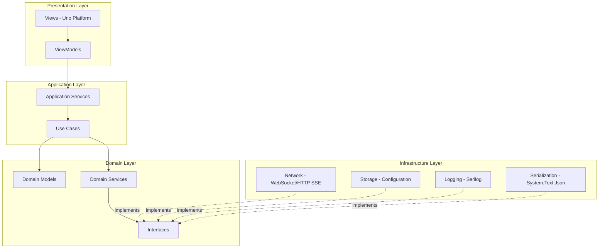

# SalmonEgg 架构文档

## 概述

SalmonEgg 是一个基于 Uno Platform 的跨平台原生应用程序，实现 Agent Client Protocol (ACP) 以与 AI 代理进行通信。该项目采用现代架构设计原则，强调代码质量、可维护性和可扩展性。

## 架构模式

本项目采用 **MVVM (Model-View-ViewModel)** 架构模式结合 **Clean Architecture** 原则：

### 四层架构

```
Presentation Layer (UI)
       ↓
Application Layer
       ↓
Domain Layer
       ↑
Infrastructure Layer
```

1. **Presentation Layer (表示层)**: Uno Platform 视图和 ViewModel
2. **Application Layer (应用层)**: 应用服务、用例编排
3. **Domain Layer (领域层)**: 核心业务逻辑、领域模型
4. **Infrastructure Layer (基础设施层)**: 外部依赖实现（网络、存储、日志）

这种分层确保了：
- 业务逻辑与 UI 框架解耦
- 核心逻辑不依赖外部框架
- 易于测试和维护
- 支持未来的技术栈迁移

## 项目结构

```
SalmonEgg/
├── src/
│   ├── SalmonEgg/                      # Uno Platform 共享项目（Presentation）
│   │   ├── Presentation/
│   │   │   ├── ViewModels/                # ViewModel 层
│   │   │   ├── Views/                     # XAML 视图
│   │   │   └── Converters/                # 值转换器
│   │   ├── App.xaml                       # 应用程序入口
│   │   └── DependencyInjection.cs         # DI 容器配置
│   │
│   ├── SalmonEgg.Application/          # 应用层（.NET Standard 2.1）
│   │   ├── Services/                      # 应用服务接口和实现
│   │   ├── UseCases/                      # 业务用例
│   │   ├── Common/                        # 通用组件（Result 模式）
│   │   └── Validators/                    # FluentValidation 验证器
│   │
│   ├── SalmonEgg.Domain/               # 领域层（.NET Standard 2.1）
│   │   ├── Models/                        # 领域模型
│   │   ├── Services/                      # 领域服务接口
│   │   └── Exceptions/                    # 领域异常
│   │
│   └── SalmonEgg.Infrastructure/       # 基础设施层（.NET Standard 2.1）
│       ├── Network/                       # 网络传输实现
│       ├── Serialization/                 # 消息解析和序列化
│       ├── Storage/                       # 持久化和配置
│       └── Logging/                       # 日志配置
│
├── tests/
│   ├── SalmonEgg.Domain.Tests/
│   ├── SalmonEgg.Application.Tests/
│   └── SalmonEgg.Infrastructure.Tests/
│
├── docs/
│   ├── architecture.md                    # 本文档
│   ├── build-guide.md                     # 构建指南
│   └── coding-standards.md                # 代码规范
│
└── SalmonEgg.sln
```

## 组件关系图



## 数据流

### 1. 连接流程

```
User Clicks "Connect"
       ↓
MainViewModel.ConnectAsync()
       ↓
ConnectionService.ConnectAsync(configId)
       ↓
ConnectToServerUseCase.ExecuteAsync(configId)
       ↓
1. Load configuration (ConfigurationManager)
2. Validate configuration (FluentValidation)
3. ConnectionManager.ConnectAsync(config)
       ↓
   a. Select transport (WebSocket/HTTP SSE)
   b. Establish connection
   c. Send initialization message
   d. Start heartbeat mechanism
       ↓
ConnectionStateChanges → MainViewModel
       ↓
UI Updates (status color, buttons enabled/disabled)
```

### 2. 消息发送流程

```
User Enters Method/Parameters + Clicks "Send"
       ↓
MainViewModel.SendMessageAsync()
       ↓
MessageService.SendRequestAsync(method, parameters)
       ↓
SendMessageUseCase.ExecuteAsync(method, parameters)
       ↓
1. Validate input
2. Check connection status
3. Create ACP message
4. ConnectionManager.SendMessageAsync(message)
       ↓
   Transport sends message via WebSocket/HTTP
       ↓
5. Wait for response (timeout: 30s)
       ↓
Response received → Message added to history
       ↓
UI Updates (message history list)
```

### 3. 消息接收流程

```
Server sends notification
       ↓
Transport receives message
       ↓
ConnectionManager.OnMessageReceived(json)
       ↓
1. Parse message (AcpMessageParser)
2. Check if it's a response to pending request
   - Yes: Complete TaskCompletionSource
   - No: Add to incoming messages stream
       ↓
MainViewModel subscription receives update
       ↓
UI Updates (message history list)
```

## 核心组件

### Domain Layer

| 组件 | 职责 |
|------|------|
| `AcpMessage` | ACP 协议消息模型（Id, Type, Method, Params, Result, Error） |
| `ConnectionState` | 连接状态模型（Status, ServerUrl, ConnectedAt, ErrorMessage） |
| `ServerConfiguration` | 服务器配置模型（Id, Name, ServerUrl, Transport, Authentication） |
| `IAcpProtocolService` | ACP 消息解析和序列化接口 |
| `IConnectionManager` | 连接管理接口（连接、断开、发送消息） |

### Application Layer

| 组件 | 职责 |
|------|------|
| `ConnectToServerUseCase` | 连接到服务器的用例（加载配置、验证、建立连接） |
| `SendMessageUseCase` | 发送消息的用例（验证输入、创建消息、等待响应） |
| `DisconnectUseCase` | 断开连接的用例 |
| `ConnectionService` | 封装连接用例，提供连接状态查询 |
| `MessageService` | 封装消息发送用例，提供通知消息流 |
| `Result<T>` | 操作结果模式（避免异常控制流） |

### Infrastructure Layer

| 组件 | 职责 |
|------|------|
| `AcpMessageParser` | 实现 `IAcpProtocolService`，使用 System.Text.Json 解析/序列化 |
| `ConnectionManager` | 实现 `IConnectionManager`，管理连接生命周期 |
| `WebSocketTransport` | WebSocket 传输实现（使用 Websocket.Client 库） |
| `HttpSseTransport` | HTTP SSE 传输实现 |
| `ConfigurationManager` | 配置持久化管理（加密敏感信息） |
| `SecureStorage` | 安全存储基础实现 |

### Presentation Layer

| 组件 | 职责 |
|------|------|
| `MainViewModel` | 主界面逻辑（连接、消息发送、历史显示） |
| `SettingsViewModel` | 设置页面逻辑（配置管理） |
| `ConfigurationEditorViewModel` | 配置编辑对话框逻辑 |
| `MessageViewModel` | 消息历史项视图模型 |
| `ConnectionStatusToColorConverter` | 连接状态到颜色的转换器 |

## 依赖注入配置

所有服务在 `DependencyInjection.cs` 中注册：

```csharp
public static class DependencyInjection
{
    public static IServiceCollection AddSalmonEgg(this IServiceCollection services)
    {
        ConfigureLogging(services);
        RegisterDomainServices(services);
        RegisterInfrastructureServices(services);
        RegisterApplicationServices(services);
        RegisterViewModels(services);
        return services;
    }
    // ...
}
```

### 服务生命周期

| 服务 | 生命周期 | 原因 |
|------|----------|------|
| `IAcpProtocolService` | Singleton | 无状态，线程安全 |
| `IConnectionManager` | Singleton | 管理全局连接状态 |
| `IConfigurationService` | Singleton | 配置缓存和持久化 |
| `IConnectionService` | Singleton | 封装单例的 ConnectionManager |
| `IMessageService` | Singleton | 订阅全局消息流 |
| ViewModels | Transient | 每次导航创建新实例 |

## 扩展指南

### 添加新的传输协议

1. 在 Domain 层扩展 `TransportType` 枚举
2. 在 Infrastructure 层创建新传输类实现 `ITransport` 接口
3. 在 `DependencyInjection.cs` 中注册新传输
4. 更新 `TransportFactory` 方法

### 添加新的配置字段

1. 在 `ServerConfiguration` 模型中添加属性
2. 在 `ConfigurationEditorViewModel` 中添加对应属性
3. 在 XAML 中添加输入控件
4. 更新 `ServerConfigurationValidator` 添加验证规则

### 添加新的 ViewModel

1. 创建类继承 `ViewModelBase`
2. 使用 `[ObservableProperty]` 特性声明属性
3. 使用 `[RelayCommand]` 特性声明命令
4. 在 `DependencyInjection.cs` 中注册

## 测试策略

### 单元测试

- 领域层：验证模型和领域服务
- 应用层：验证用例逻辑和服务编排
- 基础设施层：验证传输、解析、存储实现

### 属性测试（FsCheck）

- 消息解析 Round-Trip 属性
- 配置序列化 Round-Trip 属性
- 连接状态转换属性

### 集成测试

- 端到端连接流程
- 配置持久化流程

## 技术选型

| 技术 | 用途 | 选择理由 |
|------|------|----------|
| **Uno Platform** | 跨平台 UI 框架 | 官方推荐，支持多平台，与 WinUI 兼容 |
| **CommunityToolkit.Mvvm** | MVVM 框架 | 轻量级，性能好，官方支持 |
| **System.Text.Json** | JSON 序列化 | .NET 内置，性能优异 |
| **Serilog** | 日志记录 | 结构化日志，丰富的 Sink 支持 |
| **Websocket.Client** | WebSocket 客户端 | 成熟稳定，支持自动重连 |
| **Polly** | 弹性处理 | 重试、断路器策略，行业标准 |
| **FluentValidation** | 数据验证 | 流畅 API，易于测试 |
| **Reactive Extensions** | 响应式编程 | 优雅处理异步流 |

## 参考资料

- [Uno Platform 官方文档](https://platform.uno/docs/)
- [CommunityToolkit.Mvvm](https://learn.microsoft.com/dotnet/communitytoolkit/mvvm/)
- [Clean Architecture](https://blog.cleancoder.com/uncle-bob/2012/08/13/the-clean-architecture.html)
- [ACP Protocol Specification](https://spec.modelcontextprotocol.io/)